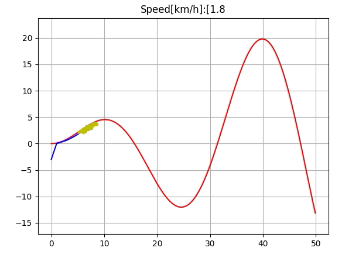

# particle_filtering_model_predictive_control  
Particle filtering model predictive control simulation.
~~~
python particle_filtering_model_predictive_control.py
~~~
## to do  
 - fix state update  
 - fix horizon control
## Result  
  
## Reference  
Dominik Stahl,JanHauth,"[PF-MPC: Particle filter-model predictive control](https://www.sciencedirect.com/science/article/pii/S0167691111001125)"  
Simada,Nishida,"[Particle filtering-model predictive control of quad-copter](http://lab.cntl.kyutech.ac.jp/~nishida/paper/2014/RSJ2014/3M1-03.pdf)",2014(in Japanse)  
[PythonRobotics Particle Filter](https://github.com/AtsushiSakai/PythonRobotics/tree/master/Localization/particle_filter)  
[PythonRobotics Pure Pursuit](https://github.com/AtsushiSakai/PythonRobotics/blob/master/PathTracking/pure_pursuit)  
